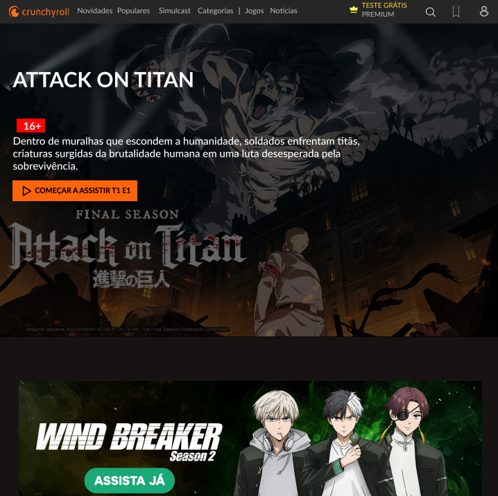
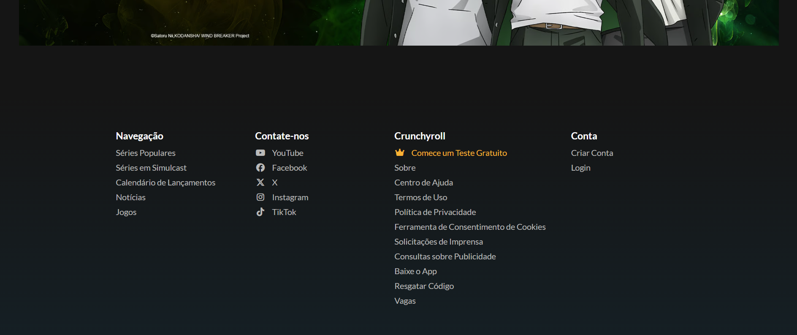
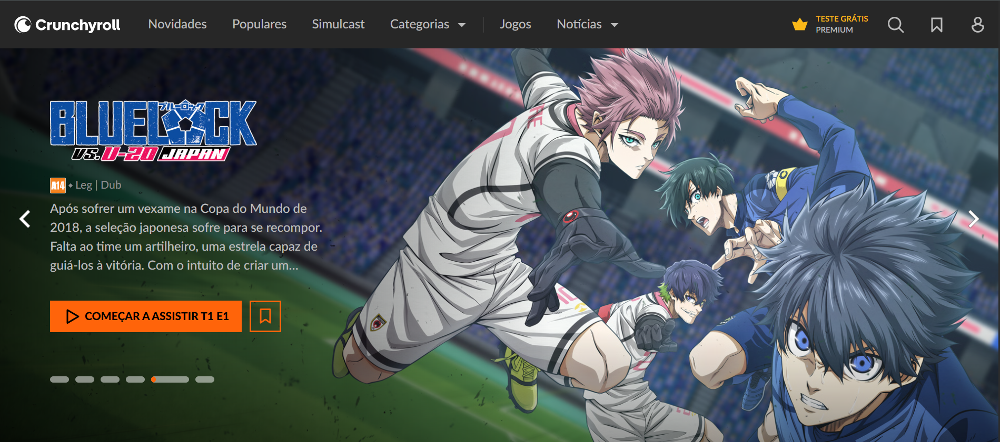

# 📖 README - Réplica Crunchyroll

## 🎯 Objetivo do Projeto
Este projeto consiste em uma **réplica simplificada da página inicial da Crunchyroll**, feita com **HTML semântico** e **CSS puro**, com o intuito de praticar **desenvolvimento front-end**, organização de layout, estilização e fidelidade visual em relação a um site real.

---

## 🖼️ Protótipo
Foram comparadas duas versões:

- **Site Réplica (Projeto desenvolvido)**  
  → Criado em HTML semântico + CSS, focado no anime *Attack on Titan*.  
  → Possui navbar fixa, banner de destaque, seção de destaque secundária e rodapé.  

- **Site Real (Crunchyroll Oficial)**  
  → Exibe outros animes em destaque, além de um carrossel interativo.  
  → Contém as mesmas seções principais, mas com recursos adicionais em JavaScript.  

---

## ⚙️ Tecnologias Utilizadas
- **HTML5 (semântico)** → Estrutura do site, com tags como `<header>`, `<nav>`, `<section>`, `<main>` e `<footer>` para melhor organização e acessibilidade  
- **CSS** → Estilização e responsividade básica  
- **Google Fonts (Lato)** → Fonte para os textos  
- **Font Awesome** → Ícones (coroa, usuário, pesquisa, redes sociais, etc.)  

---

## 🚀 Funcionalidades
✔ Navbar fixa com logo e menus (Novidades, Populares, Simulcast, Categorias, Jogos e Notícias)  
✔ Ícones de busca, favoritos e usuário no canto superior direito  
✔ Botão de **Teste Grátis Premium** com destaque em amarelo  
✔ Banner principal com imagem de fundo (*Attack on Titan*) e descrição do anime  
✔ Botão para **Começar a Assistir** estilizado em laranja  
✔ Seção de destaque com outro anime (*Wind Breaker*)  
✔ Rodapé com:
  - Links de navegação  
  - Redes sociais (YouTube, Facebook, X, Instagram, TikTok)  
  - Informações da Crunchyroll (Ajuda, Termos, Política, Vagas etc.)  
  - Links da conta (Criar/Login)  

---

## 🎨 Estilização
- Paleta de cores baseada no site oficial:  
  - **#151515** → Fundo principal  
  - **#272727** → Navbar  
  - **#f9b234 / #FFD43B** → Destaques (Premium/Teste grátis)  
  - **#ff7c2c / #ff8000** → Botão de assistir  
  - **#babab9** → Textos secundários  

- Layout responsivo básico utilizando **flexbox**  
- Efeitos de **hover** em menus, botões e links  
- Imagens de fundo com **filtro de brilho** para destacar o texto  

---

## ▶️ Como Executar
1. Baixe o projeto ou clone o repositório  
2. Abra o arquivo `index.html` em qualquer navegador  
3. O site será exibido com o layout replicado  

---

## 📷 Capturas de Tela
### 🔸 Site Réplica

### 🔸 Site Real

---

 **Projeto acadêmico de prática em *HTML semântico & CSS* inspirado no site oficial da Crunchyroll.**  
